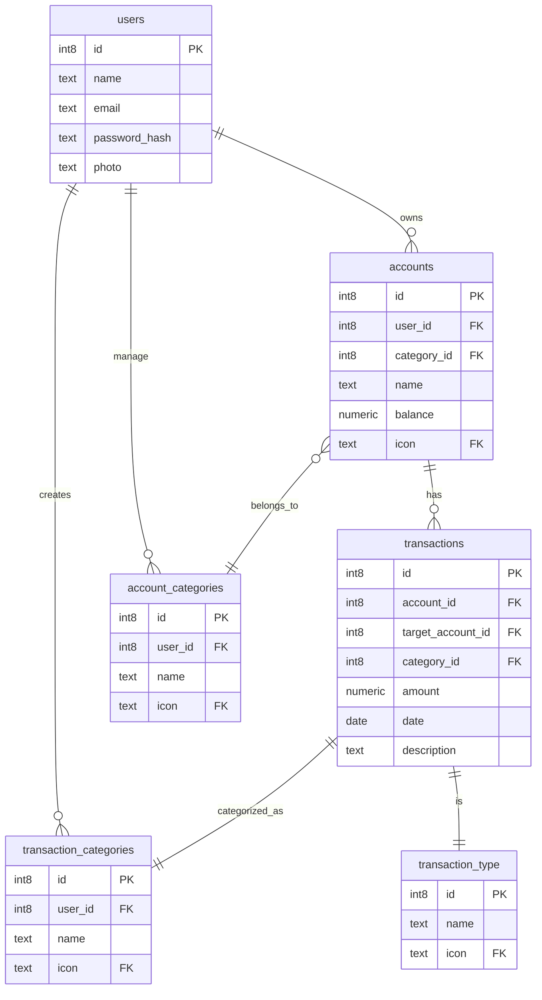

```mermaid
erDiagram

    users {
        int8 id PK
        text name
        text email
        text password_hash
        text photo
    }

    accounts {
        int8 id PK
        int8 user_id FK
        int8 category_id FK
        text name
        numeric balance
        text icon FK
    }

    transactions {
        int8 id PK
        int8 account_id FK
        int8 target_account_id FK
        int8 category_id FK
        numeric amount
        date date
        text description
    }

    account_categories {
        int8 id PK
        int8 user_id FK
        text name
        text icon FK
    }

    transaction_categories {
        int8 id PK
        int8 user_id FK
        text name
        text icon FK
    }

    transaction_type {
        int8 id PK
        text name
        text icon FK
    }


    users ||--o{ accounts : owns
    users ||--o{ transaction_categories : creates
    users ||--o{ account_categories : manage

    accounts ||--o{ transactions : has
    accounts }o--|| account_categories : belongs_to
    transactions ||--|| transaction_categories : categorized_as
    transactions ||--|| transaction_type : is

```